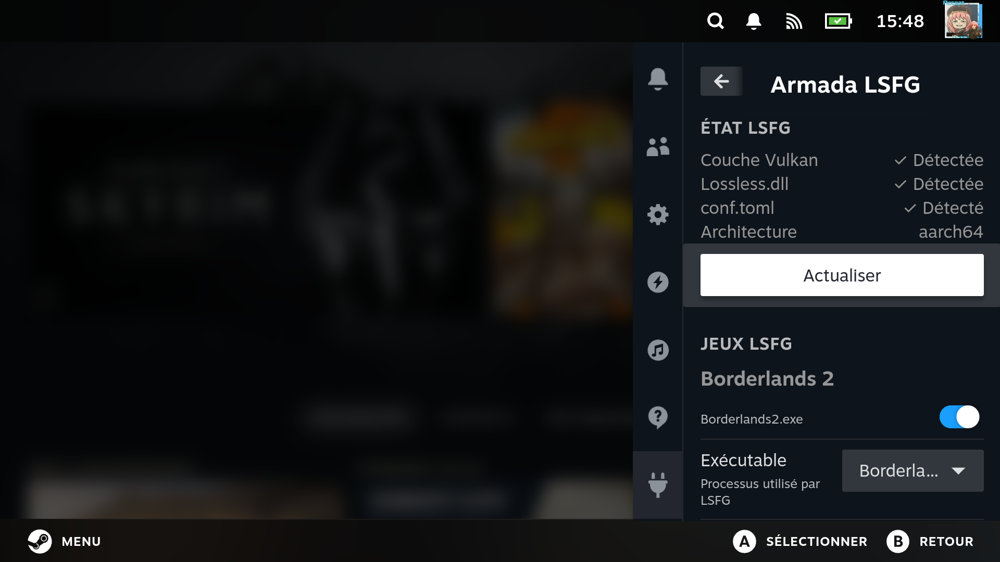
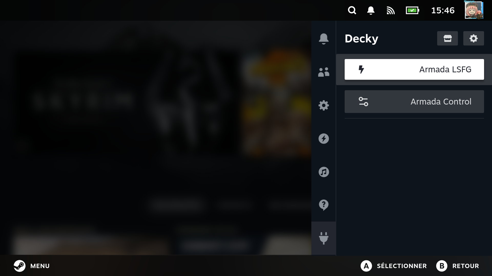
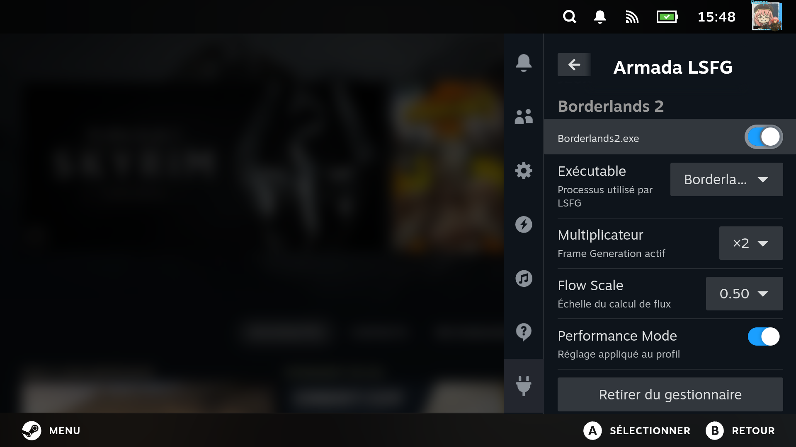
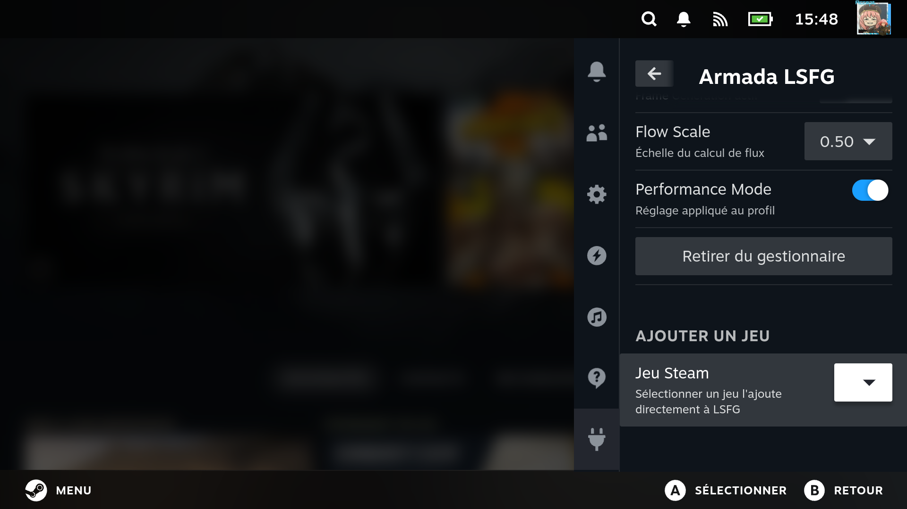

# Armada LSFG

<p align="center">
  
</p>

<p align="center">
  
  
  
</p>

🇫🇷 **Projet français — documentation disponible en français et en anglais.**

🇬🇧 **French project — documentation available in French and English.**

---

## 🇫🇷 Français

Armada LSFG est un plugin Decky **non officiel** permettant de gérer des profils LSFG-VK sous ArmadaOS.

Le projet a été créé à l'origine uniquement pour un usage personnel, puis publié afin que d'autres utilisateurs puissent éventuellement l'utiliser, l'améliorer ou s'en inspirer.

Le projet étant français et n'ayant pas été conçu initialement pour une diffusion publique, **l'interface du plugin n'est pas nécessairement entièrement traduite**. Certaines chaînes peuvent rester uniquement en français.

La documentation publique est toutefois maintenue autant que possible en français et en anglais.

- [Documentation complète en français](docs/fr/README.md)
- [Guide d'installation complet](docs/fr/INSTALLATION.md)
- [Mise à jour et désinstallation](MAINTENANCE.md)
- [Déclaration sur le développement assisté par IA](docs/fr/AI_DISCLOSURE.md)
- [Crédits, dépendances et projets tiers](docs/fr/THIRD_PARTY_NOTICES.md)

---

## 🇬🇧 English

Armada LSFG is an **unofficial** Decky plugin for managing LSFG-VK profiles on ArmadaOS.

The project was originally created solely for personal use, then published so that other users could potentially use it, improve it, or use it as a reference.

Because this is a French project that was not originally intended for public distribution, **the plugin interface may not be fully translated**. Some interface strings may remain available only in French.

Public documentation is nevertheless maintained in both French and English whenever possible.

- [Full English documentation](docs/en/README.md)
- [Complete installation guide](docs/en/INSTALLATION.md)
- [Update and uninstall](MAINTENANCE.md)
- [AI development disclosure](docs/en/AI_DISCLOSURE.md)
- [Credits, dependencies and third-party projects](docs/en/THIRD_PARTY_NOTICES.md)

---

# Installation rapide / Quick installation

> [!WARNING]
> Armada LSFG dépend d'ArmadaOS, de LSFG-VK et d'une copie achetée de Lossless Scaling.
>
> Armada LSFG requires ArmadaOS, LSFG-VK, and a purchased copy of Lossless Scaling.

## 🇫🇷 Installation

### 1. Installer ArmadaOS

Installez **[ArmadaOS](https://github.com/virtudude/armada)** en suivant la documentation officielle correspondant exactement à votre appareil.

Avant de commencer :

- vérifiez la [liste officielle des appareils pris en charge](https://github.com/virtudude/armada#supported-devices) ;
- suivez la procédure ArmadaOS adaptée à votre modèle ;
- ne flashez jamais un ABL destiné à un autre appareil ou à un autre SoC.

### 2. Acheter et installer Lossless Scaling

Achetez puis installez **[Lossless Scaling sur Steam](https://store.steampowered.com/app/993090/Lossless_Scaling/)** sur ArmadaOS.

LSFG-VK utilise notamment le fichier `Lossless.dll` provenant de votre propre installation de Lossless Scaling.

### 3. Installer LSFG-VK pour ArmadaOS / aarch64

Le plus simple est de réaliser cette étape **en SSH depuis un PC**. Cela permet de copier/coller les commandes plus facilement et de suivre l'installation depuis un vrai terminal.

#### Activer SSH dans ArmadaOS

1. Ouvrez le **Quick Access Menu**.
2. Ouvrez **Decky**, puis **Armada Control**.
3. Activez **SSH** dans Armada Control.
4. Relevez l'adresse IP de votre appareil sur votre réseau local.
5. Depuis un PC connecté au même réseau, ouvrez un terminal et connectez-vous :

```bash
ssh armada@ADRESSE_IP
```

Exemple :

```bash
ssh armada@192.168.1.50
```

Lors de la première connexion, acceptez l'empreinte SSH si elle correspond bien à votre appareil.

Identifiants par défaut de l'image ArmadaOS :

```text
Utilisateur : armada
Mot de passe : armada
```

> [!IMPORTANT]
> ArmadaOS est livré avec ce mot de passe connu et SSH est désactivé par défaut. Une fois SSH activé, toute personne ayant accès à votre réseau local peut tenter de se connecter tant que le mot de passe par défaut n'a pas été changé.
>
> Il est fortement recommandé de modifier immédiatement le mot de passe avec :
>
> ```bash
> passwd
> ```
>
> Utilisez ensuite ce nouveau mot de passe pour les connexions SSH et les demandes `sudo`.

Une fois connecté en SSH, installez LSFG-VK.

Armada LSFG est prévu pour fonctionner avec le build ARM64 suivant :

**[Zensenshi/lsfg-vk-odin2-armada](https://github.com/Zensenshi/lsfg-vk-odin2-armada)**

Depuis Desktop Mode, ouvrez Konsole puis exécutez :

```bash
cd ~
git clone https://github.com/Zensenshi/lsfg-vk-odin2-armada.git
cd lsfg-vk-odin2-armada
chmod +x install.sh
./install.sh
```

Ce build est basé sur le projet **[PancakeTAS/lsfg-vk](https://github.com/PancakeTAS/lsfg-vk)**.

### 4. Installer Armada LSFG

Depuis Konsole :

```bash
curl -fL \
  https://github.com/BakaPute/ArmadaLSFG/releases/latest/download/install.sh \
  -o /tmp/armada-lsfg-install.sh

chmod +x /tmp/armada-lsfg-install.sh

/tmp/armada-lsfg-install.sh
```

L'installateur :

- télécharge la dernière release Armada LSFG ;
- vérifie le SHA-256 du package ;
- vérifie les fichiers et métadonnées nécessaires à Decky ;
- sauvegarde l'installation précédente si elle existe ;
- installe Armada LSFG dans Decky ;
- conserve les configurations utilisateur LSFG ;
- **ne modifie pas les Launch Options Steam**.

### 5. Redémarrer et vérifier

Après l'installation :

1. redémarrez l'appareil ;
2. ouvrez le Quick Access Menu ;
3. ouvrez Decky ;
4. sélectionnez **Armada LSFG** ;
5. vérifiez que LSFG-VK et `Lossless.dll` sont détectés.

➡️ [Guide d'installation complet en français](docs/fr/INSTALLATION.md)

## Mettre à jour Armada LSFG

Il n'est pas nécessaire de désinstaller l'ancienne version.

Depuis Konsole ou une connexion SSH sur l'appareil ArmadaOS :

```bash
curl -fL \
  https://github.com/BakaPute/ArmadaLSFG/releases/latest/download/install.sh \
  -o /tmp/armada-lsfg-install.sh

chmod +x /tmp/armada-lsfg-install.sh

/tmp/armada-lsfg-install.sh
```

L'installateur sauvegarde l'installation précédente, installe la dernière release publiée et conserve les configurations utilisateur.

Après la mise à jour :

```bash
sudo reboot
```

➡️ [Guide complet de mise à jour et désinstallation](MAINTENANCE.md)

## Désinstaller Armada LSFG

Pour supprimer uniquement Armada LSFG :

```bash
sudo rm -rf ~/homebrew/plugins/ArmadaLSFG
sudo reboot
```

Cette opération ne supprime pas LSFG-VK, Lossless Scaling ni `~/.config/lsfg-vk/`.

Pour supprimer également les paramètres propres à Armada LSFG :

```bash
rm -rf ~/.config/armada-lsfg-manager
```

Pour supprimer également les sauvegardes Armada LSFG :

```bash
rm -rf ~/ArmadaLSFG-backups
```

➡️ [Guide complet de mise à jour et désinstallation](MAINTENANCE.md)

---

## 🇬🇧 Installation

### 1. Install ArmadaOS

Install **[ArmadaOS](https://github.com/virtudude/armada)** using the official procedure for your exact device.

Before starting:

- check the [official supported devices list](https://github.com/virtudude/armada#supported-devices);
- follow the ArmadaOS procedure for your exact model;
- never flash an ABL intended for another device or SoC.

### 2. Purchase and install Lossless Scaling

Purchase and install **[Lossless Scaling on Steam](https://store.steampowered.com/app/993090/Lossless_Scaling/)** on ArmadaOS.

LSFG-VK uses files from your own Lossless Scaling installation, including `Lossless.dll`.

### 3. Install LSFG-VK for ArmadaOS / aarch64

The easiest way to complete this step is **over SSH from a PC**. This makes it much easier to copy/paste commands and follow the installation from a proper terminal.

#### Enable SSH in ArmadaOS

1. Open the **Quick Access Menu**.
2. Open **Decky**, then **Armada Control**.
3. Enable **SSH** in Armada Control.
4. Note the IP address of your device on your local network.
5. From a PC connected to the same network, open a terminal and connect:

```bash
ssh armada@DEVICE_IP
```

Example:

```bash
ssh armada@192.168.1.50
```

On the first connection, accept the SSH host fingerprint if it matches your device.

Default ArmadaOS image credentials:

```text
Username: armada
Password: armada
```

> [!IMPORTANT]
> ArmadaOS ships with this known default password and SSH is disabled by default. Once SSH is enabled, anyone with access to your local network can attempt to log in until the default password has been changed.
>
> It is strongly recommended to change the password immediately with:
>
> ```bash
> passwd
> ```
>
> Then use the new password for SSH connections and `sudo` prompts.

Once connected over SSH, install LSFG-VK.

Armada LSFG is intended to work with this ARM64 build:

**[Zensenshi/lsfg-vk-odin2-armada](https://github.com/Zensenshi/lsfg-vk-odin2-armada)**

From Desktop Mode, open Konsole and run:

```bash
cd ~
git clone https://github.com/Zensenshi/lsfg-vk-odin2-armada.git
cd lsfg-vk-odin2-armada
chmod +x install.sh
./install.sh
```

This build is based on **[PancakeTAS/lsfg-vk](https://github.com/PancakeTAS/lsfg-vk)**.

### 4. Install Armada LSFG

From Konsole:

```bash
curl -fL \
  https://github.com/BakaPute/ArmadaLSFG/releases/latest/download/install.sh \
  -o /tmp/armada-lsfg-install.sh

chmod +x /tmp/armada-lsfg-install.sh

/tmp/armada-lsfg-install.sh
```

The installer:

- downloads the latest Armada LSFG release;
- verifies the package SHA-256 checksum;
- validates the Decky files and metadata;
- backs up the previous installation when present;
- installs Armada LSFG into Decky;
- preserves existing LSFG user configuration;
- **does not modify Steam Launch Options**.

### 5. Restart and verify

After installation:

1. restart the device;
2. open the Quick Access Menu;
3. open Decky;
4. select **Armada LSFG**;
5. verify that LSFG-VK and `Lossless.dll` are detected.

➡️ [Complete installation guide in English](docs/en/INSTALLATION.md)

## Update Armada LSFG

You do not need to uninstall the previous version first.

From Konsole or an SSH session on the ArmadaOS device:

```bash
curl -fL \
  https://github.com/BakaPute/ArmadaLSFG/releases/latest/download/install.sh \
  -o /tmp/armada-lsfg-install.sh

chmod +x /tmp/armada-lsfg-install.sh

/tmp/armada-lsfg-install.sh
```

The installer backs up the previous installation, installs the latest published release and preserves user configuration.

After updating:

```bash
sudo reboot
```

➡️ [Complete update and uninstall guide](MAINTENANCE.md)

## Uninstall Armada LSFG

To remove only Armada LSFG:

```bash
sudo rm -rf ~/homebrew/plugins/ArmadaLSFG
sudo reboot
```

This does not remove LSFG-VK, Lossless Scaling or `~/.config/lsfg-vk/`.

To also remove Armada LSFG settings:

```bash
rm -rf ~/.config/armada-lsfg-manager
```

To also remove Armada LSFG backups:

```bash
rm -rf ~/ArmadaLSFG-backups
```

➡️ [Complete update and uninstall guide](MAINTENANCE.md)

---

## Transparence / Transparency

Le code spécifique à Armada LSFG a été développé en grande partie avec l'aide d'**[OpenAI ChatGPT](https://openai.com/chatgpt/)**, à partir des besoins, choix, tests, journaux et retours de BakaPute.

Project-specific Armada LSFG code was developed substantially with the assistance of **[OpenAI ChatGPT](https://openai.com/chatgpt/)**, based on BakaPute's requirements, decisions, testing, logs, and feedback.

Le projet s'appuie également sur plusieurs projets externes, notamment LSFG-VK, lsfg-vk-odin2-armada, Decky Loader et le Decky Plugin Template.

The project also relies on several external projects, including LSFG-VK, lsfg-vk-odin2-armada, Decky Loader, and the Decky Plugin Template.

- [AI disclosure / Développement IA](AI_DISCLOSURE.md)
- [Third-party notices / Projets tiers](THIRD_PARTY_NOTICES.md)

---

## Projet non officiel / Unofficial project

Armada LSFG is not affiliated with, sponsored by, or endorsed by:

- [ArmadaOS](https://github.com/virtudude/armada)
- [AYN](https://www.ayntec.com/)
- [Decky Loader / SteamDeckHomebrew](https://github.com/SteamDeckHomebrew/decky-loader)
- [Valve / Steam](https://store.steampowered.com/)
- [Lossless Scaling](https://store.steampowered.com/app/993090/Lossless_Scaling/)
- [LSFG-VK](https://github.com/PancakeTAS/lsfg-vk)
- [PancakeTAS](https://github.com/PancakeTAS)
- [Zensenshi](https://github.com/Zensenshi)
- [OpenAI](https://openai.com/)

All product names, trademarks and project names belong to their respective owners.

---

## Auteur / Author

**[BakaPute](https://github.com/BakaPute)**

---

## Version

**v0.1.5**
